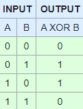
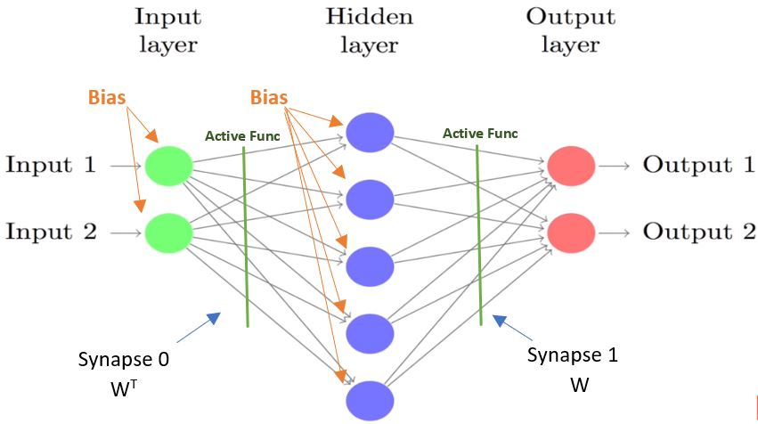
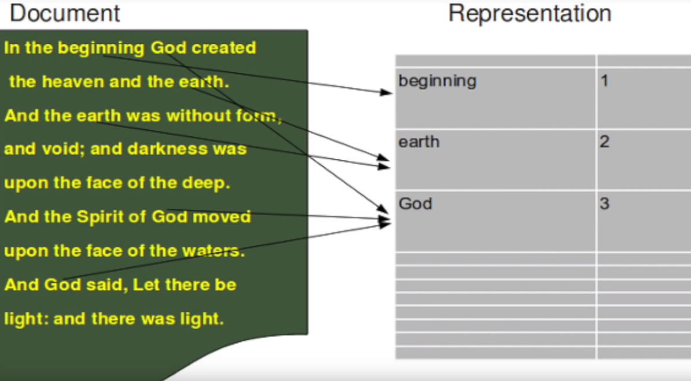
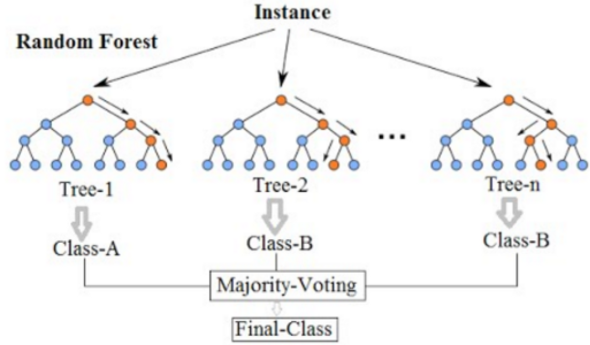

# ML Exercises
## A collection of some runnable machine learning scripts that make use of some libraries like scikit, tensorflow, etc

### 1. Simple-NN - Artificial neural network with backpropagation that simulates the XOR (or exclusive) function with two inputs and one output.

<b>Inputs and Expected Output:</b> 
    
<b>Model of the Implemented ANN:</b> 
  

  

Based on: https://github.com/stmorgan/pythonNNexample

### 2. Sentiment-analysis-moviereviews - Sentiment analysis program in Python that will identify whether a movie review is positive or negative based on the text in the review. It makes use of NLTK and RANDOM FOREST classification

  

#### Random Forest Classifier:

Based on: https://github.com/wendykan/DeepLearningMovies

Datasets retrieved from: https://www.kaggle.com/c/word2vec-nlp-tutorial/data
