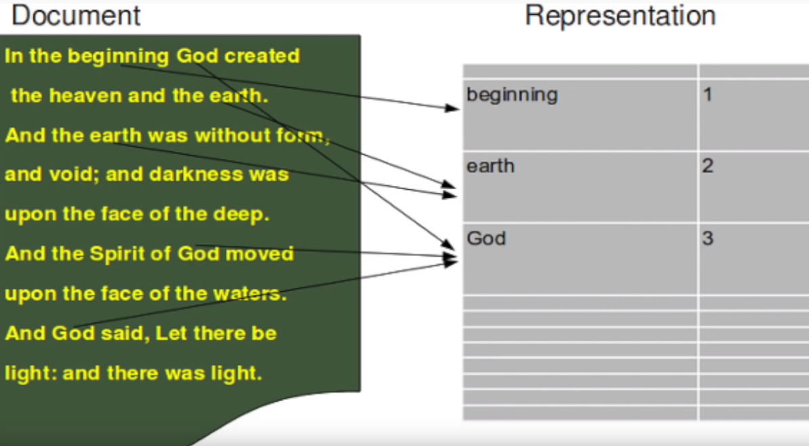

#### **Sentiment analysis program in Python that will identify whether a movie review is positive or negative based on the text in the review. It makes use of NLTK and RANDOM FOREST classification**

#### **Tokenization using sklearn:**

  

#### **Random Forest Classifier:**
  

  
Based on: https://github.com/wendykan/DeepLearningMovies
 
Datasets retrieved from: https://www.kaggle.com/c/word2vec-nlp-tutorial/data 
