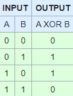
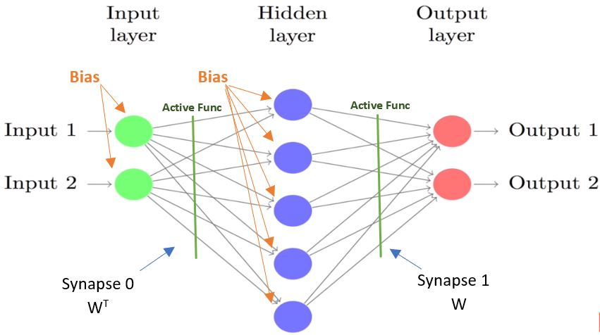

**Artificial neural network with backpropagation that simulates the XOR (or exclusive) function with two inputs and one output.**
 
 
**Inputs and Expected Output:**

  

**Model of the Implemented ANN:**
  

  
Based on: https://github.com/stmorgan/pythonNNexample
